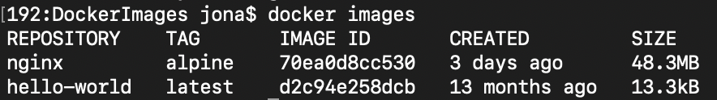

### Indicaciones para la práctica
El contenido solicitado entre paréntesis angulares debe ser reemplazado y los paréntesis angulares deben ser eliminados.

# Imagen
Es un archivo único que contiene todos los programas, librerías, dependencias y configuraciones necesarias para instalar y/o ejecutar una aplicación o un conjunto de aplicaciones.


## ¿Cuál es la relación entre una imagen y un contenedor? 
Dentro del campo de docker se puede extraer estas definiciones de una Imagen y un Contenedor:

- **Imagen:** Es una plantilla que define todo lo necesario para ejecutar una aplicación, incluyendo el sistema operativo, las bibliotecas, las dependencias y la aplicación misma.
- **Contenedor:** Es una instancia en ejecución de una imagen Docker. Cuando una imagen se ejecuta, crea un contenedor, que es una instancia con su propio sistema de archivos, red y espacio de procesos.


## Comandos para imágenes

### Descargar imagen
Descarga la última versión de la imagen disponible en el registro de Docker.

```
docker pull <nombre imagen> 
```

Descarga una versión específica de la imagen, cada imagen tiene etiquetas (tags) para diferentes versiones.
Una imagen puede tener la etiqueta latest para representar la última versión, si no se especifica una etiqueta se hará referencia a la versión latest.

```
docker pull <nombre imagen>:<tag>
```

#### Descargar la imagen **hello-world**
Para descargar la ultima version de la imagen **hello-world** se usa el siguiente comando
```
docker pull hello-world
```

#### **¿Qué es nginx?**

Nginx, pronunciado como “engine-ex”, es un servidor web de código abierto que, desde su éxito inicial como servidor web, ahora también es usado como proxy inverso, cache de HTTP, y balanceador de carga.

Diseñado para manejar solicitudes HTTP y HTTPS, Nginx es un servidor web y proxy inverso de código abierto eficiente y utilizado en Internet que se destaca por su capacidad para servir contenido web de manera rápida y eficiente, así que puede funcionar como servidor web principal o como intermediario entre los clientes y los servidores de aplicación.

#### Descargar la imagen  **nginx** en la versión **alpine**

Para descargar la version alpine de la imagen nginx se debe ejecutar el siguiente comando

```
docker pull nginx:alpine
```

### Listar imágenes

```
docker images
```


**Identificadores:**
En Docker, se utilizan varios identificadores para diferenciar de manera única los elementos del sistema, como imágenes, contenedores, volúmenes y redes. Estos identificadores son generados automáticamente por Docker y son únicos dentro del contexto del sistema Docker en el que se encuentran. 

### Inspeccionar una imagen
El comando docker inspect se utiliza para obtener información detallada sobre un objeto de Docker específico, como un contenedor, una imagen, un volumen o una red.  Proporciona información en formato JSON sobre el objeto especificado.

```
docker inspect <nombre imagen>
docker inspect <nombre imagen>:<tag>
```

#### Inspeccionar la imagen hello-world
Para inspeccionar la imagen **hello-world** se ejecuta el siguiente comando: 
```
docker inspect hello-world
```

**¿Con qué algoritmo se está generando el ID de la imagen:**
La imagen se está generando con el algoritmo **SHA-256**.
SHA-256 (Secure Hash Algorithm 256-bit) es una función hash criptográfica que produce un hash de 256 bits (64 caracteres en formato hexadecimal). Es ampliamente utilizada por su seguridad y eficiencia.

### Filtrar imágenes

```
docker images | grep <termino a buscar>

```

### Eliminar una imagen
Eliminar permanentemente la imagen de tu sistema Docker.

```
docker rmi <nombre imagen>:<tag>
```

#### Eliminar la imagen hello-world 
Para eliminar la imagen hello-world se usa el siguiente commando
```
docker rmi hwllo-world
```

-f: Es la opción para forzar la eliminación de la imagen incluso si hay contenedores en ejecución que utilizan esa imagen.
Cuando eliminas una imagen Docker, Docker no elimina automáticamente los contenedores que se han creado a partir de esa imagen. Esto significa que, aunque hayas eliminado la imagen, el contenedor seguirá ejecutándose normalmente.  
**Considerar**
Eliminar una imagen no afecta a los contenedores que se han creado a partir de esa imagen, a menos que esos contenedores dependan de archivos o configuraciones específicas de la imagen eliminada. En ese caso, es posible que los contenedores se comporten de manera inesperada después de eliminar la imagen.
Es una buena práctica detener y eliminar todos los contenedores que dependan de una imagen antes de eliminar la imagen en sí.

```
docker rmi -f <nombre imagen>:<tag>
```

